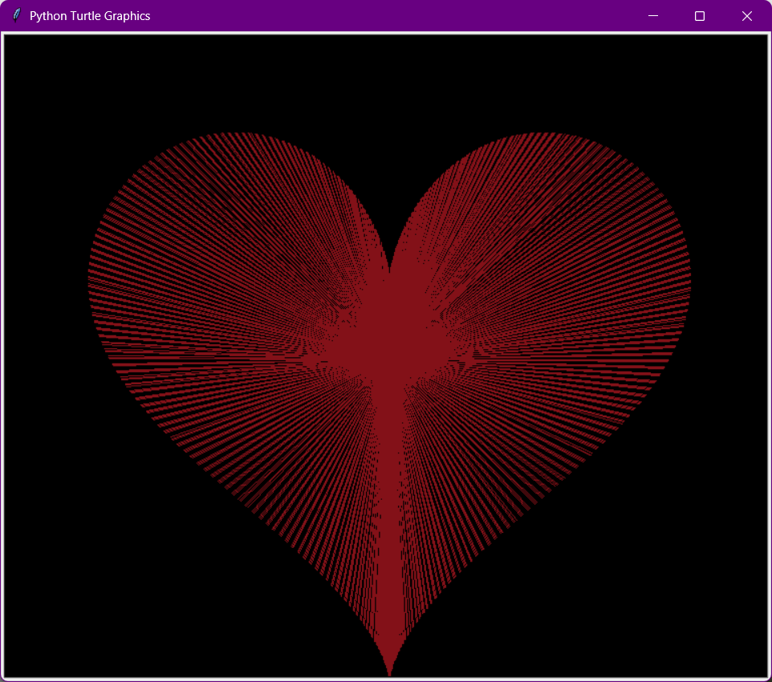

<div align="center">

# 💖 What I Do Instead of Studying 📚

### *Because drawing hearts with Python is clearly more important than my exam tomorrow*



[](https://www.python.org/)
[](https://github.com/willow788/what-i-do-instead-of-studying)
[](https://github.com/willow788/what-i-do-instead-of-studying)

</div>

---

## 🎭 The Story

You know that feeling when you have a huge exam coming up, mountains of notes to review, and a deadline approaching at light speed? Yeah, me too.  

So naturally, I decided to code a heart animation in Python.  **Priorities. ** ✨

---

## 🚀 What's Inside

```
📦 what-i-do-instead-of-studying
 ┣ 📜 heart.py          # The masterpiece of procrastination
 ┣ 🖼️ demo.png          # Proof that I'm productive (just not at studying)
 ┗ 📄 README.md         # You are here! 
```

---

## 💫 Features

- ✅ **100% Python** - Because who needs flashcards when you have code?
- 💖 **Heart Animations** - Making something beautiful while my GPA suffers
- 🎨 **Visual Masterpiece** - At least I'm failing with style
- 🧠 **Mental Health Break** - This is self-care, right?  ... Right? 

---

## 🎮 Quick Start

### Prerequisites

- Python 3.x (and a guilty conscience)
- A looming deadline (optional but recommended for authenticity)
- The ability to ignore responsibilities

### Run It

```bash
# Clone this masterpiece
git clone https://github.com/willow788/what-i-do-instead-of-studying.git

# Navigate into procrastination central
cd what-i-do-instead-of-studying

# Execute your avoidance tactics
python heart.py
```

### Sit back and watch the magic ✨

---

## 📸 Screenshots


*Look at that! It's beautiful!  Worth failing my exam?  TBD.*

---

## 🎯 Roadmap

- [x] Create heart animation instead of studying
- [x] Make it prettier than my study notes
- [x] Write an unnecessarily elaborate README
- [ ] Actually open my textbook
- [ ] Understand the course material
- [ ] Pass the exam (fingers crossed 🤞)

---

## 🤔 FAQ

**Q: Should you be studying right now?**  
A: Absolutely.  Yes.  100%. 

**Q: Are you going to study after this?**  
A: I mean...  probably not. 

**Q: Was this worth it?**  
A: The heart looks cool, so...  yes? 

---

## 🛠️ Tech Stack

<div align="center">


</div>

---

## 💡 Inspiration

> *"The expert in anything was once a beginner who refused to study for their exams."*  
> — Probably not a real quote, but sounds good

---

## 🤝 Contributing

Got an even better way to procrastinate? PRs welcome! Together, we can avoid our responsibilities in style.

1. Fork the repo
2. Create your procrastination branch (`git checkout -b feature/AmazingAvoidanceTactic`)
3. Commit your changes (`git commit -m 'Add some creative procrastination'`)
4. Push to the branch (`git push origin feature/AmazingAvoidanceTactic`)
5. Open a Pull Request
6. Continue avoiding your actual work

---

## 📜 License

This project is licensed under the "I-Should-Really-Be-Studying" License - do whatever you want with it, just don't blame me when you fail your exam too.

---

## ⚠️ Disclaimer

**WARNING:** This repository may cause: 
- Decreased study time
- Increased procrastination skills
- A false sense of productivity
- Temporary euphoria followed by exam-induced panic
- An inexplicable urge to code instead of memorize formulas

*Use responsibly.  Your GPA will thank you.*

---

<div align="center">

### 🌟 Star this repo if you should also be studying right now 🌟

Made with 💖 and questionable life choices by [@willow788](https://github.com/willow788)

<sub>Last updated: While avoiding Chapter 7</sub>

---

**[⬆ Back to Top](#-what-i-do-instead-of-studying-)**

</div>
